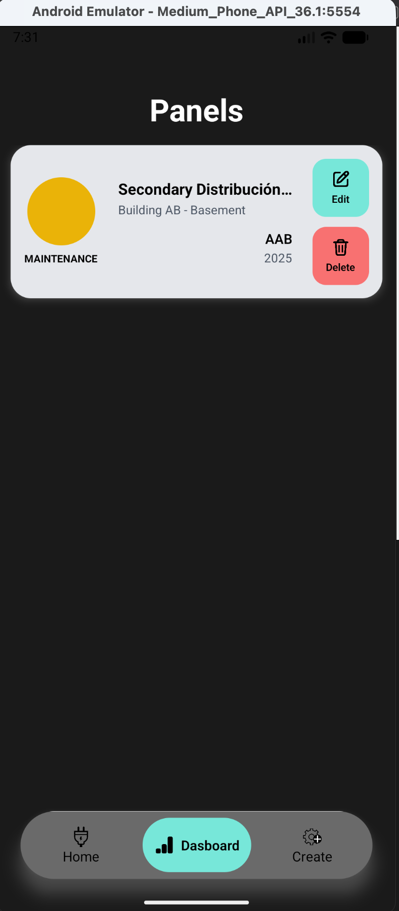
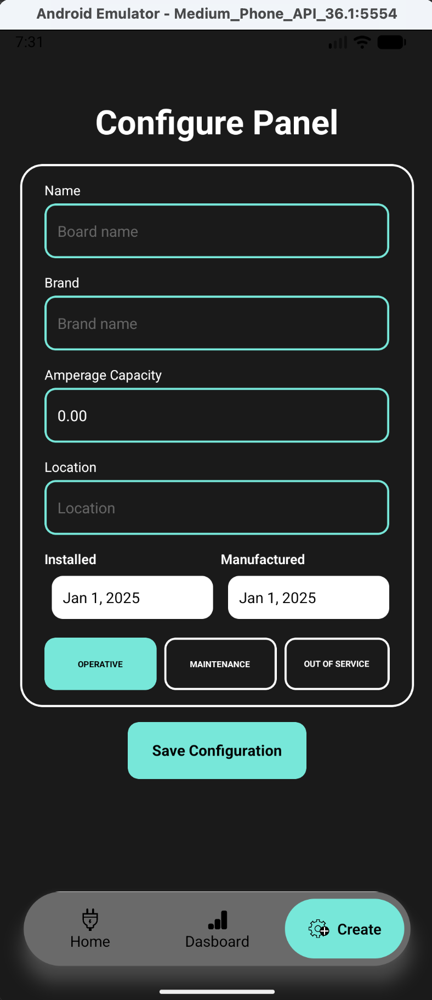
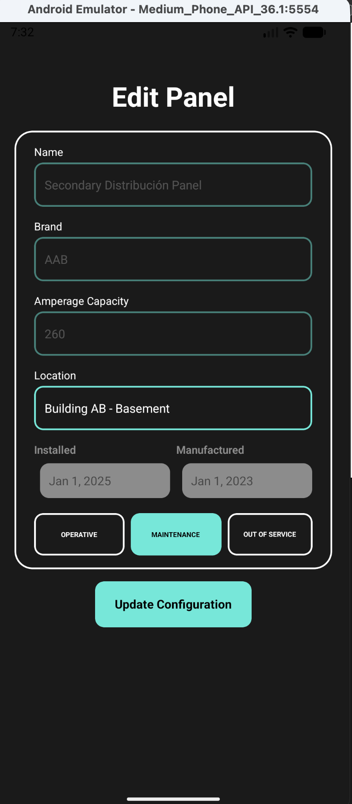
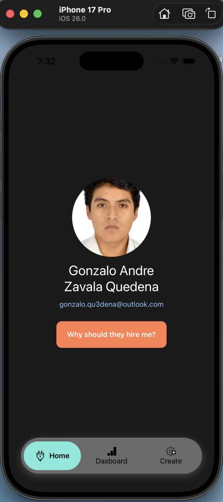
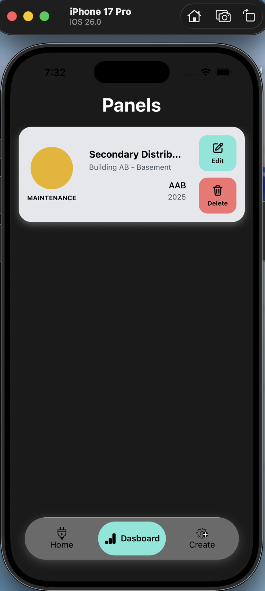
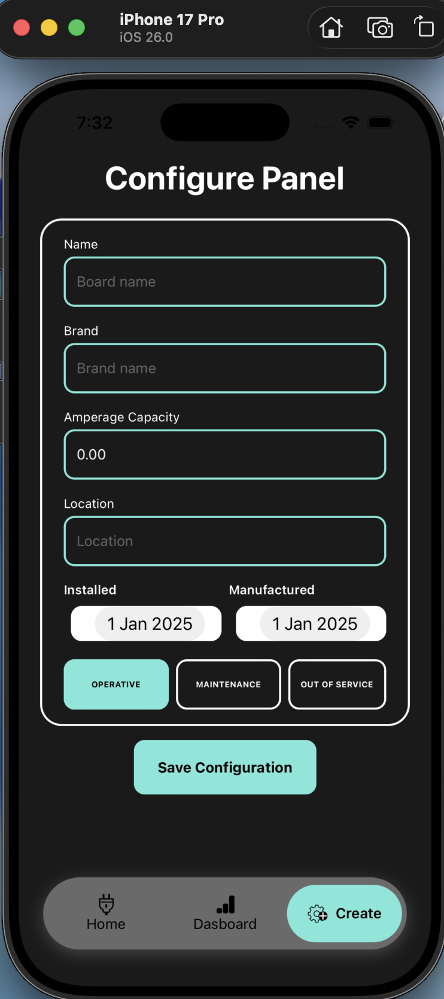
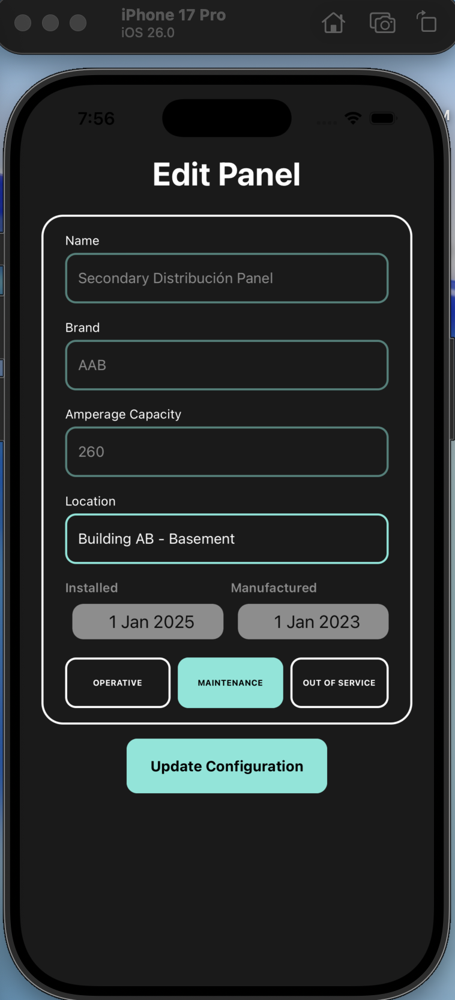

# REMS Electric Panels – Application Preview

<p>
This document provides a complete and visually compact overview of the REMS Electric Panels mobile application.
</p>

</br>

# Android Preview

<table>
  <tr>
    <td align="center">
      <strong>Home</strong><br/>
      <p align="justify"><em>Entry point to the app, providing quick access to the main panel management features. Designed to remain clean and simple for instant user recognition.</em></p><br/>
      
    </td>
    <td align="center">
      <strong>Panel List</strong><br/>
      <p align="justify"><em>Complete list of all registered electrical panels, including color-coded operational statuses and pull-to-refresh functionality for real-time updates.</em></p><br/>
      
    </td>
    <td align="center">
      <strong>Create Panel</strong><br/>
      <p align="justify"><em>Form for adding new panels with validation, date selection, and clear input separation to guide the user through accurate data entry.</em></p><br/>
      
    </td>
    <td align="center">
      <strong>Edit Panel</strong><br/>
      <p align="justify"><em>Edit mode UI allowing modification of location and operational state while maintaining business rules by restricting non-editable fields.</em></p><br/>
      
    </td>
  </tr>
</table>

</br>

# iOS Preview

<table>
  <tr>
    <td align="center">
      <strong>Home</strong><br/>
      <p align="justify"><em>Smooth iOS-styled landing screen with quick navigation access and consistent platform-native spacing and typography.</em></p><br/>
      
    </td>
    <td align="center">
      <strong>Panel List</strong><br/>
      <p align="justify"><em>iOS list view showcasing panels with soft edges and fluid transitions, preserving Apple’s human interface guidelines for familiarity.</em></p><br/>
      
    </td>
    <td align="center">
      <strong>Create Panel</strong><br/>
      <p align="justify"><em>Creation screen optimized for iOS input controls, offering a clean experience with dynamic date picker behavior.</em></p><br/>
      
    </td>
    <td align="center">
      <strong>Edit Panel</strong><br/>
      <p align="justify"><em>Update screen enabling panel state changes and installation adjustments, aligned with iOS native interaction patterns.</em></p><br/>
      
    </td>
  </tr>
</table>

</br>

# Summary

This visual preview demonstrates the complete functionality of the mobile application across both platforms:

- Full CRUD workflow (create, list, edit, delete)
- Real-time data synchronization with backend API
- Clear operational status representation through color coding
- Hybrid navigation system (Tab + Stack) powered by Expo Router
- Responsive design with NativeWind (Tailwind)
- Form validation and controlled inputs
- Clean architecture using layered separation and the Assembler pattern
- Identical functional flow for Android and iOS while respecting each platform’s design conventions

</br>

# Screenshot Folder Structure

```txt
screenshots/
├── android-home.png
├── android-list-panels.png
├── android-create-panel.png
├── android-edit-panel.png
├── ios-home.png
├── ios-list-panels.png
├── ios-create-panel.png
├── ios-edit-list.png
└── APP_PREVIEW.md
```